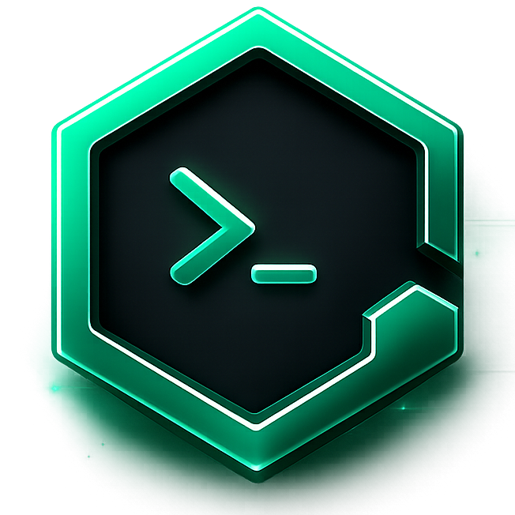

<div align="center">



# Ghost Shell

**A fast, cross-platform SSH & SFTP client — built with Tauri, React, and Rust.**

[](https://github.com/ghost-maintainer/ghost-shell/actions/workflows/build.yml)
[](https://github.com/ghost-maintainer/ghost-shell/releases/latest)
[](LICENSE)

[](https://tauri.app)

[**Download**](#-download) · [**Install**](#-installation) · [**Develop**](#-development) · [**Roadmap**](#-roadmap)

</div>

---

> [!NOTE]
> **Project status: early development.** The desktop shell, navigation, theming, and the full
> cross-platform CI/CD pipeline are in place. The SSH/SFTP engine and encrypted vault are under
> active development — see the [Roadmap](#-roadmap).

## ✨ Features

- 🔐 **SSH host management** — organise and connect to your servers from one place
- 📁 **SFTP browser** — transfer and manage remote files _(in progress)_
- 🗝️ **Encrypted keychain** — credentials secured behind a master password _(in progress)_
- 💾 **Import / export & backup** of your hosts and keys
- 🎨 **Light / dark / system themes**
- 🖥️ **Truly cross-platform** — native installers for Windows, macOS, and Linux
- ⚡ **Tiny & native** — Rust core, no bundled browser engine (Tauri)

## 📦 Download

### **[⬇ Download the latest release →](https://github.com/ghost-maintainer/ghost-shell/releases/latest)**

Prebuilt installers for every platform are published on the
[**Releases**](https://github.com/ghost-maintainer/ghost-shell/releases) page, generated
automatically by CI whenever a `v*` tag is pushed. Pick the file that matches your system:

| Platform    | Architecture        | Recommended file                                       |
| ----------- | ------------------- | ------------------------------------------------------ |
| **Windows** | x64 (Intel / AMD)   | `Ghost Shell_<ver>_x64-setup.exe`                      |
| **Windows** | ARM64               | `Ghost Shell_<ver>_arm64-setup.exe`                   |
| **macOS**   | Apple Silicon (M1+) | `Ghost Shell_<ver>_aarch64.dmg`                       |
| **macOS**   | Intel               | `Ghost Shell_<ver>_x64.dmg`                           |
| **macOS**   | Any Mac (universal) | `Ghost Shell_<ver>_universal.dmg`                    |
| **Linux**   | x86_64              | `Ghost Shell_<ver>_amd64.AppImage`                   |

<details>
<summary>Other formats</summary>

- **Windows:** `.msi` (`Ghost Shell_<ver>_<arch>_en-US.msi`) for managed/silent installs
- **Linux:** `.deb` (Debian/Ubuntu) and `.rpm` (Fedora/RHEL) packages

</details>

> `<ver>` is the release version (e.g. `0.1.0`). GitHub displays spaces in asset names as dots.

> [!WARNING]
> **All builds are unsigned.** This project does not (yet) have an Apple Developer, Windows
> code-signing, or Linux package-signing certificate, so your OS will warn you the first time you
> open the app. The installers are safe — you simply need to allow them once, as shown below.

## 🛠 Installation

###  Windows

Windows **SmartScreen** will show *"Windows protected your PC."*

1. Run **`Ghost Shell_<ver>_x64-setup.exe`** (use the `arm64` build on ARM devices).
2. Click **More info → Run anyway**.
3. Complete the installer.

```powershell
# Silent install via MSI (for IT-managed environments)
msiexec /i "Ghost Shell_<ver>_x64_en-US.msi" /qn
```

###  macOS

Because the app is unsigned and un-notarized, Gatekeeper blocks the first launch with
*"Ghost Shell is damaged…"* or *"…cannot be opened because Apple cannot check it."* This is
expected — clear the quarantine flag:

1. Open the `.dmg` and drag **Ghost Shell** into **Applications**.
2. Remove the quarantine attribute:

   ```bash
   xattr -dr com.apple.quarantine "/Applications/Ghost Shell.app"
   ```

3. Launch normally from Applications / Launchpad.

> **No-Terminal alternative:** try to open the app once (it gets blocked), then go to
> **System Settings → Privacy & Security**, scroll down, and click **Open Anyway**. _(Required on
> macOS 15 Sequoia, which removed the old right-click → Open shortcut.)_

###  Linux (x86_64)

**AppImage** — portable, nothing to install:

```bash
chmod +x "Ghost Shell_<ver>_amd64.AppImage"
./"Ghost Shell_<ver>_amd64.AppImage"     # needs FUSE: sudo apt install libfuse2
```

**Debian / Ubuntu:**

```bash
sudo apt install "./Ghost Shell_<ver>_amd64.deb"
```

**Fedora / RHEL / openSUSE:**

```bash
sudo dnf install "./Ghost Shell-<ver>-1.x86_64.rpm"
```

## 💻 Development

### Prerequisites

- [**Node.js**](https://nodejs.org) 20+
- [**Rust**](https://rustup.rs) (stable toolchain) + the Tauri
  [system dependencies](https://tauri.app/start/prerequisites/) for your OS

### The `ghost` CLI

The entire project lifecycle runs through one wrapper — `scripts/ghost.js` — so you never call
`vite` or `tauri` directly:

```bash
npm run ghost dev            # install deps + start the dev app (hot reload)
npm run ghost build          # build installers for the current OS
npm run ghost build <target> # cross-build a specific target/group
npm run ghost icon           # regenerate app icons from src/assets/app-icon.png
```

While `dev` is running: **Ctrl + R** restarts the app, **Ctrl + C** quits (and clears
`node_modules` for a clean next run).

#### Build targets

| Target          | Output                                  |
| --------------- | --------------------------------------- |
| _(none)_        | Current operating system                |
| `win:64`        | Windows x86_64                          |
| `win:arm`       | Windows ARM64                           |
| `win`           | Both Windows targets                    |
| `mac:intel`     | macOS Intel                             |
| `mac:arm`       | macOS Apple Silicon                     |
| `mac:universal` | macOS universal binary                  |
| `mac`           | All three macOS targets                 |

Missing Rust targets are installed automatically via `rustup target add`. After a build, only the
final installers are kept — flattened into `build/`, with all intermediates removed:

```
build/
├─ Ghost Shell_0.1.0_x64-setup.exe
└─ Ghost Shell_0.1.0_x64_en-US.msi
```

> **Tip:** for a direct, unzipped download of any installer, use the **Releases** page — GitHub
> always serves Actions artifacts as a `.zip`, whereas release assets are the raw files.

## 🧱 Project structure

```
ghost-shell/
├─ .github/workflows/build.yml   # CI: parallel multi-platform builds + releases
├─ scripts/ghost.js              # project CLI (dev / build / icon)
├─ src/                          # React 19 frontend
│  ├─ pages/                     #   routed views (hosts, keychain, sftp, settings, …)
│  ├─ components/ui/             #   shadcn/ui component library
│  ├─ layouts/                   #   app shell & navigation
│  ├─ provider/                  #   theme provider
│  └─ css/                       #   Tailwind v4 styles
├─ src-tauri/                    # Rust backend (Tauri 2)
│  ├─ src/                       #   Rust source
│  ├─ Cargo.toml
│  └─ tauri.conf.json            #   window / bundle configuration
└─ package.json
```

## 🧰 Tech stack

| Layer        | Technology                                              |
| ------------ | ------------------------------------------------------- |
| Shell        | [Tauri 2](https://tauri.app) (Rust)                     |
| Frontend     | [React 19](https://react.dev) · [Vite](https://vite.dev) · [React Router](https://reactrouter.com) |
| UI / styling | [Tailwind CSS 4](https://tailwindcss.com) · [shadcn/ui](https://ui.shadcn.com) · [Lucide](https://lucide.dev) |
| Tooling      | Node-based `ghost` CLI · GitHub Actions                 |

## 🗺 Roadmap

- [x] Cross-platform desktop shell, routing & theming
- [x] One-command `ghost` developer CLI
- [x] Parallel CI builds + automated releases (Windows / macOS / Linux)
- [ ] SSH connection backend (Rust)
- [ ] Interactive terminal sessions
- [ ] SFTP file browser & transfers
- [ ] Encrypted keychain with master-password unlock
- [ ] Host management UI, logs, settings & data import/export
- [ ] Code signing & notarization

## 🤝 Contributing

Contributions are welcome! To get started:

1. Fork the repository and create a feature branch.
2. Run `npm run ghost dev` and make your changes.
3. Ensure `npm run ghost build` succeeds for your platform.
4. Open a pull request with a clear description of the change.

## 📄 License

Source-available under the [**Ghost Shell License**](LICENSE) — a modified MIT license.

You are free to **use, modify, and redistribute** the source code. However, the product name
**"Ghost Shell"**, the author/brand **"GhostCompiler"**, and the copyright notice must be
preserved in all copies and derivative works. Rebranding or distributing under a different name
requires prior written permission. See the [LICENSE](LICENSE) for full terms.
