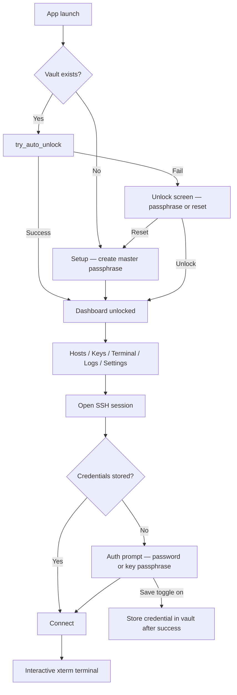

# Ghost Shell

**A native SSH & SFTP desktop client by [Ghost Compiler](https://github.com/ghost-maintainer/ghost-shell).**

Built with **Tauri 2**, **React 19**, and **Rust** — small, fast, and truly cross-platform.

[Build status](https://github.com/ghost-maintainer/ghost-shell/actions/workflows/build.yml) · [Latest release](https://github.com/ghost-maintainer/ghost-shell/releases/latest) · [License](LICENSE)

---

## Overview

| | |
|---|---|
| **App name** | Ghost Shell |
| **Publisher** | Ghost Compiler |
| **Bundle ID** | `com.ghostcompiler.ghost-shell` |
| **Platforms** | Windows · macOS · Linux |

Ghost Shell is a local-first SSH client. Your hosts, keys, and passwords live in an **encrypted vault** on your machine. The app unlocks once per session (or automatically via OS keychain / session file), then gives you host management, an encrypted keychain, interactive terminal tabs, session logs, and vault import/export.

---

## How the app works

### High-level architecture

```
┌─────────────────────────────────────────────────────────────┐
│  React UI (Vite)                                            │
│  hosts · keychain · terminal · logs · import/export · login │
└───────────────────────────┬─────────────────────────────────┘
                            │ Tauri IPC (invoke + channels)
┌───────────────────────────▼─────────────────────────────────┐
│  Rust backend (src-tauri)                                   │
│  vault · secure_store · ssh · google_drive · supabase       │
└───────────────────────────┬─────────────────────────────────┘
                            │
         ┌──────────────────┼──────────────────┐
         ▼                  ▼                  ▼
   vault.enc          OS keychain         Remote SSH/SFTP
   (AES-256-GCM)      session unlock      (russh)
```

- **Frontend** — React pages under `src/pages/`, shared UI in `src/components/`, global state in `src/provider/`.
- **Backend** — Rust commands in `src-tauri/src/lib.rs`; SSH sessions stream terminal I/O over Tauri channels.
- **Storage** — Encrypted `vault.enc` in the app data directory; optional cloud sync via Supabase (credentials baked in at CI build time).

### Application flow



#### 1. First launch (setup)

1. No vault file exists → user is sent to **Login / Setup**.
2. User creates a **master passphrase** (minimum strength enforced in UI).
3. Rust derives a key (PBKDF2 + AES-256-GCM) and creates `vault.enc`.
4. Session key is saved to **OS keychain** (with `session.dat` fallback on Windows).

#### 2. Returning launch (unlock)

1. `vault_exists` → `try_auto_unlock` reads keychain / session file.
2. If auto-unlock succeeds → dashboard opens immediately.
3. If it fails → **Keychain unlock screen** (passphrase recovery or wipe).

#### 3. Daily use

| Area | What it does |
|------|----------------|
| **Hosts** | Add/edit/delete servers; optional stored password; assign SSH keys |
| **Keychain** | Generate or import keys; optional passphrase storage |
| **Terminal** | Tabbed SSH sessions (xterm.js); reconnect; session persistence |
| **Logs** | Full session scrollback (7-day retention); reconnect from history |
| **Import / Export** | Encrypted `.enc` vault backup and restore |
| **Settings** | Theme, cloud sync, wipe data |

#### 4. SSH connection flow

1. User opens a host → `TerminalProvider` creates a session tab.
2. Rust loads host + key from vault → `ssh_connect` via **russh**.
3. Status events (`resolve` → `tcp` → `handshake` → `auth` → `pty` → `connected`) stream to the terminal.
4. If credentials are missing → modal prompts for password or key passphrase (optional **Save passphrase** toggle).
5. Keystrokes are batched to Rust; output streams back over a channel.
6. On cancel → session shows **Connection canceled by user**; on bad credentials → **Authentication failed**.

#### 5. Security model

- Master passphrase never stored in plaintext.
- Host passwords and key passphrases stored **inside the encrypted vault**.
- Auto-unlock uses OS keychain (`GhostShell` service) or encrypted session file.
- Production builds disable browser devtools / right-click inspect.
- Vault export uses the same encryption as the live vault (or backup passphrase on import).

---

## Download

### [⬇ Latest release](https://github.com/ghost-maintainer/ghost-shell/releases/latest)

CI builds run on every push; releases are published from `main`, version tags (`v*`), or manual workflow dispatch.

| Platform | Architecture | File |
|----------|--------------|------|
| **Windows** | x64 | `Ghost Shell_<ver>_x64-setup.exe` |
| **Windows** | ARM64 | `Ghost Shell_<ver>_arm64-setup.exe` |
| **Windows** | x64 / ARM64 | `Ghost Shell_<ver>_<arch>_en-US.msi` |
| **macOS** | Apple Silicon | `Ghost Shell_<ver>_aarch64.dmg` |
| **macOS** | Intel | `Ghost Shell_<ver>_x64.dmg` |
| **macOS** | Universal | `Ghost Shell_<ver>_universal.dmg` |
| **Linux** | x86_64 | `.AppImage` · `.deb` · `.rpm` |

`<ver>` is the semver from `package.json` (e.g. `1.0.0`).

> **Note:** All release builds are **unsigned**. Your OS may warn on first launch — see [Installation](#installation) below.

---

## Installation

### Windows

1. Download `Ghost Shell_<ver>_x64-setup.exe` (or `arm64` on ARM PCs).
2. If SmartScreen shows *"Windows protected your PC"*, click **More info → Run anyway**.
3. Complete the installer.

**Silent MSI install (IT / managed):**
```powershell
msiexec /i "Ghost Shell_1.0.0_x64_en-US.msi" /qn
```

### macOS

1. Open the `.dmg` and drag **Ghost Shell** to **Applications**.
2. Clear quarantine (unsigned builds):
   ```bash
   xattr -dr com.apple.quarantine "/Applications/Ghost Shell.app"
   ```
3. On macOS 15+, use **System Settings → Privacy & Security → Open Anyway** if Gatekeeper blocks the first launch.

### Linux

**AppImage:**
```bash
chmod +x "Ghost Shell_1.0.0_amd64.AppImage"
./"Ghost Shell_1.0.0_amd64.AppImage"
```

**Debian / Ubuntu:**
```bash
sudo apt install "./Ghost Shell_1.0.0_amd64.deb"
```

**Fedora / RHEL:**
```bash
sudo dnf install "./Ghost Shell-1.0.0-1.x86_64.rpm"
```

---

## Development

### Prerequisites

- [Node.js](https://nodejs.org) 20+ (CI uses 24)
- [Rust](https://rustup.rs) stable + [Tauri prerequisites](https://tauri.app/start/prerequisites/)

### Local environment

Create a `.env` file in the project root for local dev (not committed):

```env
VITE_SUPABASE_URL=https://your-project.supabase.co
VITE_SUPABASE_PUBLISHABLE_KEY=your-publishable-key
VITE_GITHUB=https://github.com/GhostCompiler
```

Vite embeds `VITE_*` variables at build time. CI injects the Supabase keys from the **PROD** GitHub environment instead.

### The `ghost` CLI

All project tasks go through `scripts/ghost.js`:

```bash
npm run ghost dev              # install deps + Tauri dev (Ctrl+R restart, Ctrl+C quit)
npm run ghost build            # build for current OS
npm run ghost build win:64     # Windows x64 (.exe + .msi)
npm run ghost build linux      # Linux AppImage + deb + rpm
npm run ghost build mac        # all macOS targets
npm run ghost icon             # regenerate icons from src/assets/app-icon.png
```

#### Build targets

| Target | Output |
|--------|--------|
| *(none)* / `linux` | Current OS installers |
| `win:64` | Windows x64 `.exe` + `.msi` |
| `win:arm` | Windows ARM64 `.exe` + `.msi` |
| `win` | Both Windows architectures |
| `mac:intel` / `mac:arm` / `mac:universal` | macOS `.dmg` |
| `mac` | All macOS variants |

Final artifacts are flattened into `build/`; intermediates (`src-tauri/target`, `dist`) are removed automatically.

```
build/
├── Ghost Shell_1.0.0_x64-setup.exe
├── Ghost Shell_1.0.0_x64_en-US.msi
├── Ghost Shell_1.0.0_amd64.AppImage
├── Ghost Shell_1.0.0_amd64.deb
└── Ghost Shell-1.0.0-1.x86_64.rpm
```

---

## Project structure

```
ghost-shell/
├── .github/workflows/build.yml    # CI: parallel builds + releases
├── scripts/
│   └── ghost.js                   # dev / build / icon CLI
├── src/                           # React frontend
│   ├── pages/                     # hosts, keychain, logs, login, …
│   ├── provider/                  # security, terminal, theme
│   ├── components/                # UI + terminal-view
│   └── layouts/                   # dashboard shell
├── src-tauri/                     # Rust / Tauri backend
│   ├── src/                       # vault, ssh, secure_store, …
│   ├── tauri.conf.json            # shared bundle + branding
│   ├── tauri.windows.conf.json    # NSIS / WiX settings
│   └── tauri.linux.conf.json      # deb / rpm metadata
└── package.json
```

---

## CI / release management

Workflow: `.github/workflows/build.yml`

| Job | Runner | Produces |
|-----|--------|----------|
| `linux` | `ubuntu-22.04` | AppImage, deb, rpm |
| `windows-x64` | `windows-latest` | NSIS `.exe`, WiX `.msi` |
| `windows-arm64` | `windows-latest` | NSIS `.exe`, WiX `.msi` |
| `macos-*` | `macos-latest` | DMG per architecture |

All build jobs use the **PROD** GitHub environment. Required secrets:

| Secret | Purpose |
|--------|---------|
| `VITE_SUPABASE_URL` | Supabase project URL (baked into release builds) |
| `VITE_SUPABASE_PUBLISHABLE_KEY` | Supabase publishable key (baked into release builds) |

**Release job** runs when:
- A `v*` tag is pushed, or
- `main` builds succeed, or
- Manual dispatch with **Publish release** enabled

Artifacts are merged and uploaded to GitHub Releases as `v<package.json version>`.

---

## Unsigned builds

Release installers are **not code-signed**:

| Platform | What to expect |
|----------|----------------|
| **Windows** | SmartScreen *"Windows protected your PC"* — click **More info → Run anyway** |
| **macOS** | Gatekeeper block on first open — clear quarantine or use **Open Anyway** in System Settings |
| **Linux** | Packages install normally; no publisher signature |

Code signing (Windows Authenticode, Apple notarization, Linux GPG) is on the [roadmap](#roadmap) for a future release.

---

## Tech stack

| Layer | Technology |
|-------|------------|
| Shell | [Tauri 2](https://tauri.app) (Rust) |
| SSH | [russh](https://github.com/Eugeny/russh) |
| Terminal | [xterm.js](https://xtermjs.org) |
| Frontend | [React 19](https://react.dev) · [Vite](https://vite.dev) · [React Router](https://reactrouter.com) |
| UI | [Tailwind CSS 4](https://tailwindcss.com) · [shadcn/ui](https://ui.shadcn.com) |
| Crypto | AES-256-GCM vault · PBKDF2 · OS keychain |
| Cloud sync | Supabase |

---

## Roadmap

- [x] Cross-platform shell, routing, theming
- [x] `ghost` developer CLI + parallel CI
- [x] SSH terminal sessions + session logs
- [x] Encrypted vault, keychain, host management
- [x] Import / export, auto-unlock, Supabase cloud sync
- [ ] SFTP file browser & transfers
- [ ] Code signing & notarization (Windows, macOS, Linux)

---

## Contributing

1. Fork the repo and create a feature branch.
2. `npm run ghost dev` — make your changes.
3. `npm run ghost build` on your platform.
4. Open a PR with a clear description.

---

## License

Source-available under the **[Ghost Shell License](LICENSE)**.

You may use, modify, and redistribute the source. The product name **Ghost Shell**, the publisher **Ghost Compiler**, and the copyright notice must be preserved. Rebranding requires prior written permission.
